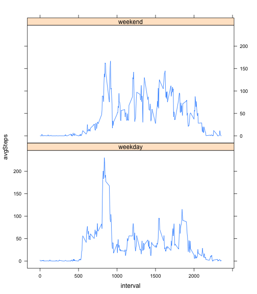

# Reproducible Research: Peer Assessment 1


## Loading and preprocessing the data

```r
    # Ensure that present working directory contains activity.csv
    dfRaw <- read.csv("activity.csv")
    # Remove NA rows
    df <- dfRaw[!is.na(dfRaw$steps),]
```


## What is mean total number of steps taken per day?

```r
stepsPerDay <- aggregate(df$steps, by=list(df$date), FUN=sum)$x
par(mfrow = c(1, 1)) 
hist(stepsPerDay, main="Histogram of Steps Per Day", 
     xlab="Steps Per Day", breaks=10)
```

 

```r
meanStepsPerDay <- mean(stepsPerDay)
medianStepsPerDay <- median(stepsPerDay)
```
The <u>mean</u> steps per day is:  <b>10766</b>  
  
The <u>median</u> steps per day is:  <b>10765</b>  


## What is the average daily activity pattern?

```r
avgStepsPer5MinInterval <- aggregate(df$steps, by=list(df$interval), FUN=mean)
names(avgStepsPer5MinInterval) <- c("interval", "avgSteps")
plot(avgStepsPer5MinInterval$interval, avgStepsPer5MinInterval$avgSteps, type="l",
     main="Average Daily Activity Pattern", 
     xlab = "5 min time interval", ylab="Avg number of steps")
```

 

```r
maxSteps5MinInterval <- avgStepsPer5MinInterval[which.max(avgStepsPer5MinInterval$avgSteps), "interval"]
```
Interval <b>835</b> contains the maximum number of steps, on average across all days.  

## Imputing missing values
The <b>Strategy for Imputing Missing Data</b> is to replace the NA step values with the average steps per 5 minute interval.  This is implemented below by joining the dfRaw dataset with the avgStepsPer5MinInterval dataset, and then replacing any NA steps with the average values for that specific interval.  A histogram is provided to show the slight change to the distribution as a result of this strategy.  


```r
countNARows <- sum(is.na(dfRaw$steps))
# Replace NA steps on each day with the average steps per interval
dfAll <- merge(dfRaw, avgStepsPer5MinInterval, by="interval")
dfAll[is.na(dfAll$steps),"steps"] <- dfAll[is.na(dfAll$steps),"avgSteps"]
dfAll <- dfAll[order(dfAll$date,dfAll$interval),c("steps","date","interval")]
stepsPerDayAll <- aggregate(dfAll$steps, by=list(dfAll$date), FUN=sum)$x
hist(stepsPerDayAll, main="Histogram of Steps Per Day \n(After missing values are imputed)", 
     xlab="Steps Per Day", breaks=10)
```

 

```r
meanStepsPerDayAll <- mean(stepsPerDayAll)
medianStepsPerDayAll <- median(stepsPerDayAll)
```

There are <b>2304</b> rows with missing values in the dataset.  
  
The <u>mean</u> steps per day is:  <b>10766</b>  
  
The <u>median</u> steps per day is:  <b>10766</b>  

Do these values differ from the estimates from the first part of the assignment?  
With this missing value replacement strategy, the mean is identical to previously calculated mean value (when NA values were dropped).  This makes sense, as the NA values were replaced with the equivalent 5 minute time interval average values.  The median has shifted slightly, towards the mean.

What is the impact of imputing missing data on the estimates of the total daily number of steps?  
Also, as a result of replacing the missing values with the interval average values, the total number of daily steps is now increased.  Again this makes sense, as we had added (created) additional steps that are not in the raw dataset.  

## Are there differences in activity patterns between weekdays and weekends?


```r
#Create a new factor variable in the dataset with two levels – “weekday” and “weekend”
isWeekend <- weekdays(as.Date(dfAll$date), abbreviate=TRUE) %in% c("Sat","Sun")
dfAll[isWeekend, "dayOfWeekType"] <- "weekend"
dfAll[!isWeekend, "dayOfWeekType"] <- "weekday"
dfAll$dayOfWeekType <- factor(dfAll$dayOfWeekType)
#Two panel plot:  Avg Steps vs Interval for "weekday" and "weekend"
avgStepsPer5MinInterval <- aggregate(dfAll$steps, by=list(dfAll$dayOfWeekType, dfAll$interval), FUN=mean)
names(avgStepsPer5MinInterval) <- c("dayOfWeekType", "interval", "avgSteps")
library(lattice)
xyplot(avgSteps ~ interval | dayOfWeekType, data = avgStepsPer5MinInterval, layout=c(1,2), type="l")
```

 

